# 「モヤポジ変換」を作った話
## ── ネガティブな気持ちをAIでポジティブに変換するWebアプリ

> **実際に試せます:** https://turn-negatives-into-positives.vercel.app
>
> 仕事中のモヤモヤをテキストで入れると、AIがドラクエ風やジブリ風など7つのトーンでポジティブに変換してくれます。正直GeminiCanvasとかでも作れそうですが、supabaseやGoogleAuthなども練習したくClaudeCodeでやってみました。

---

仕事中にちょっとしたモヤモヤを感じる場面ありますよね？。
そのとき、「この気持ちをポジティブに言い換えてほしい」と思ってとりあえず作りました。
 **「モヤポジ変換」** というWebアプリで、ネガティブな気持ちをテキストで入力すると、AIがドラクエ風やジブリ風といった7つのトーンで、少しだけ懐かしく、ほんとにちょっと笑ってしまうようなポジティブな言葉に変換してくれることをめざしました。

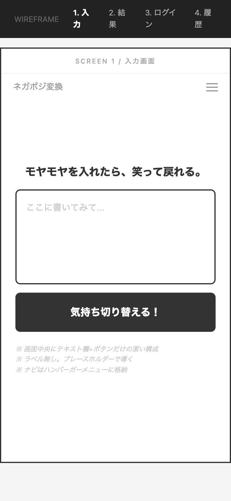

---

## どんなアプリか

### 基本の流れ

1. モヤモヤをテキストで入力する
2. 変換トーンを選ぶ（7種類）
3. 「気持ちを切り替える」ボタンを押す
4. AIがポジティブな言葉に変換してくれる

### 7つの変換トーン

変換のトーンは以下の7種類から選べます。

- **ドラクエ風** ─ 「○○は レベルが あがった！」のようなRPGメッセージ調
- **ジブリ風** ─ 自然や風景の比喩を交えた、心に染みる言葉
- **少年ジャンプ風** ─ 仲間・努力・勝利のスピリットで背中を押す
- **偉人風** ─ 歴史上の名言のような重みとユーモアのある言葉
- **FF風** ─ クリスタルや召喚獣の比喩を交えたドラマチックな言葉
- **ワンピース風** ─ 夢を諦めない真っ直ぐで熱い言葉
- **スラダン風** ─ 安西先生の名言調で語る青春の言葉

さらに「#イライラ」「#不安」「#悲しい」などの **感情タグ** を選ぶことで、その気持ちに寄り添った変換結果が返ってきます。

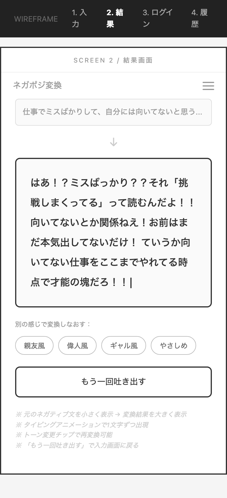

### 履歴・お気に入り管理

変換結果はすべて履歴として保存され、あとから見返すことができます。気に入った結果はお気に入りに登録したり、過去の入力を再利用して別のトーンで変換し直すことも可能です。

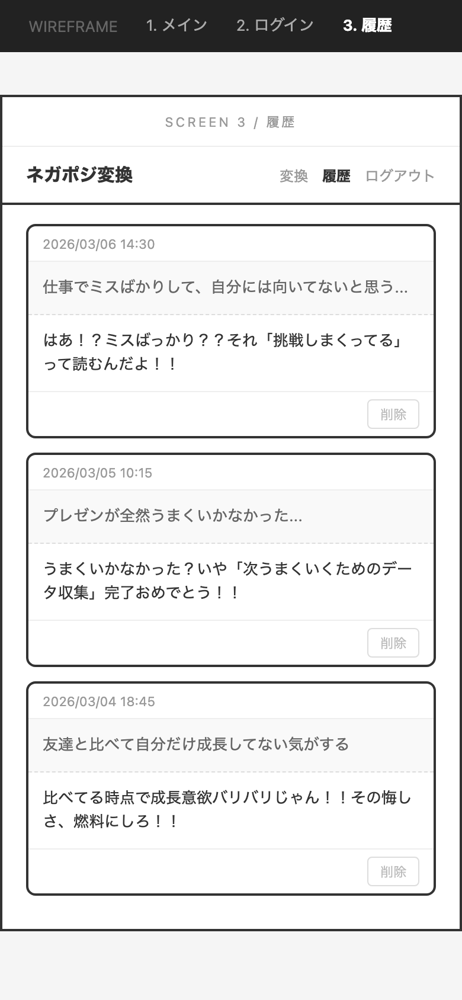

### 認証

Google OAuthでのログインに対応しています。ボタンひとつでログインでき、自分の変換履歴はアカウントに紐づいて安全に管理されます。

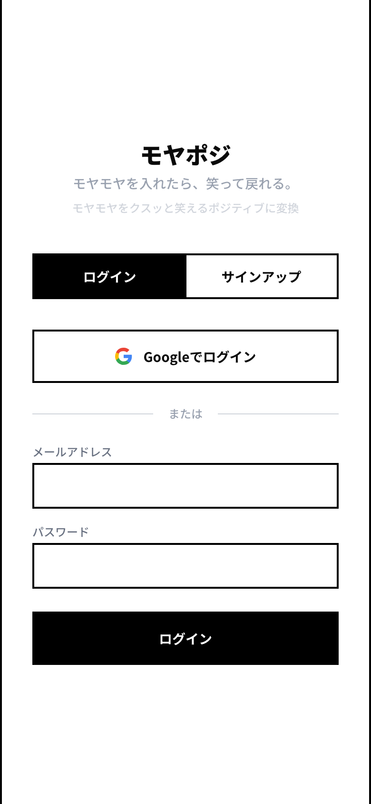

---

## デザインプロセス ── 14パターンから1つを選ぶまで

今回のアプリ開発では、実装に入る前にデザインの方向性をしっかり探ることにしました。結果的に3段階の絞り込みを経て最終デザインが決まっています。

### Step 1: まず5つの方向性を出す

最初に、まったく異なるテイストの **5つのデザインパターン** を作成しました。

| ダーク x ネオン | ポップ x カラフル | ミニマル x ホワイト |
|:---:|:---:|:---:|
| 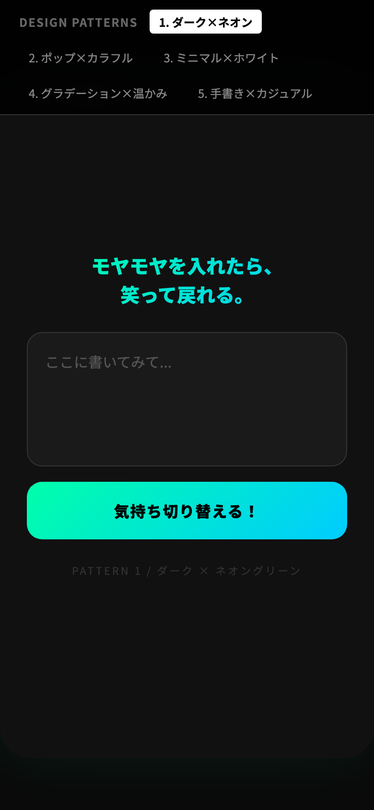 | 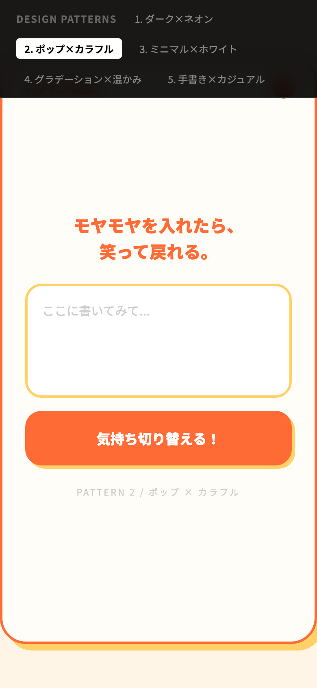 | 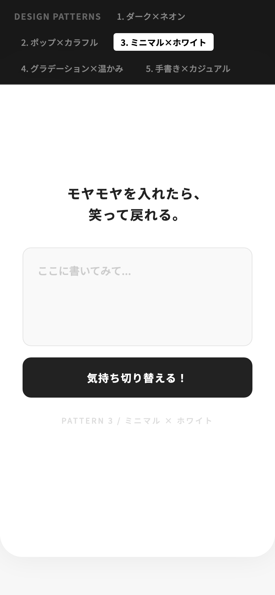 |

| グラデーション x 温かみ | 手書き x カジュアル |
|:---:|:---:|
| 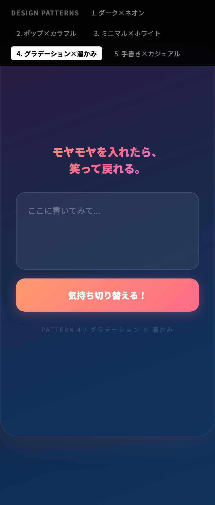 | 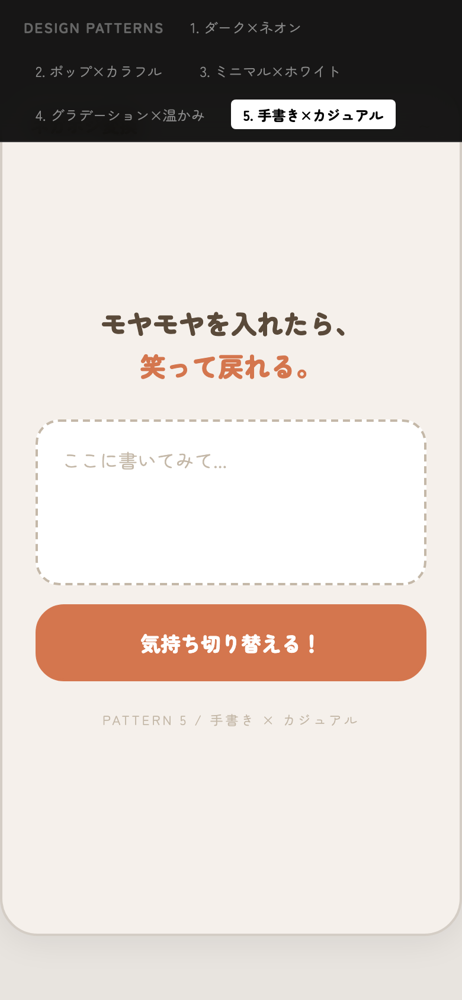 |

この中から、アプリのコンセプトに最も合っていると感じた **「Pattern 3: ミニマル x ホワイト」** を選びました。余計な装飾がなく、テキスト入力に集中できるレイアウトが「モヤモヤを吐き出す」体験にフィットすると考えたためです。

### Step 2: ミニマル路線で5バリエーション展開

Pattern 3の方向性を軸に、さらに色味やアクセントカラーを変えた **5つのバリエーション** を展開しました。

| ブルーアクセント | グリーンアクセント | モノクロ強コントラスト |
|:---:|:---:|:---:|
| 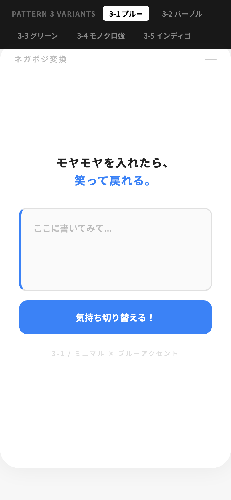 | 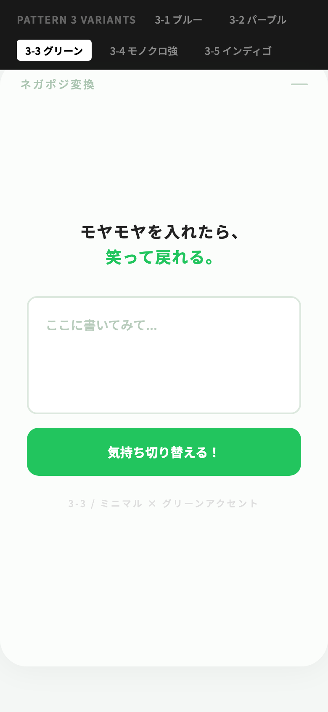 | 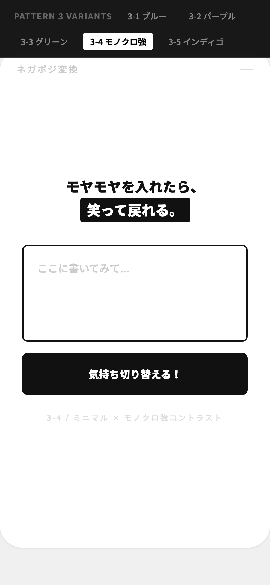 |

| インディゴ | ブルーアクセント（別案） |
|:---:|:---:|
| 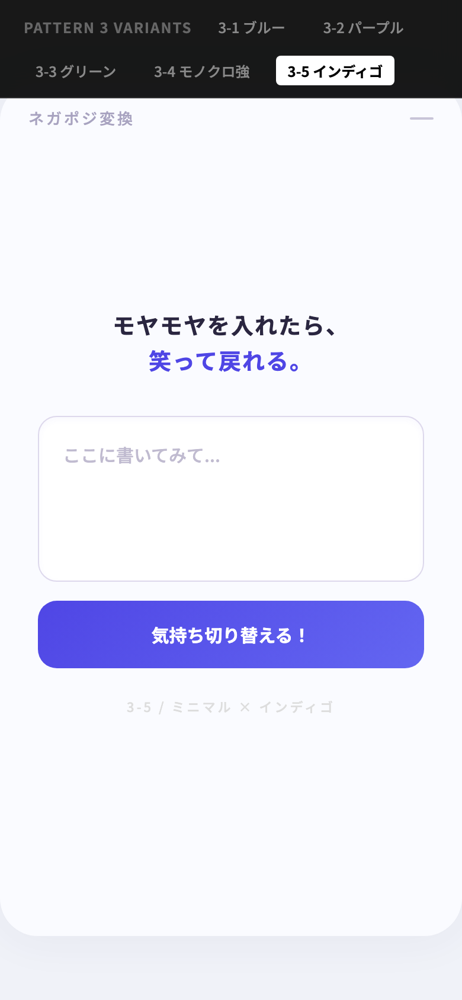 |  |

ここで気づいたのは、 **カラーアクセントを入れるほど「気軽さ」は出るが、「吐き出す」という行為の力強さが薄れる** ということでした。特に「3-4: モノクロ強コントラスト」のシンプルさに惹かれ、モノクロ路線をさらに深掘りすることにしました。

### Step 3: モノクロ5パターンで最終決定

モノクロに振り切った **5つのシャープなデザイン** を作成しました。

| 1. シャープ | 2. ソフト | 3. タイポ |
|:---:|:---:|:---:|
| 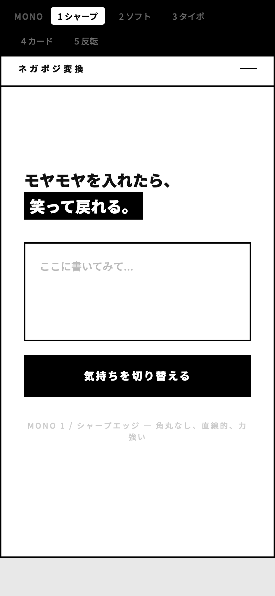 | 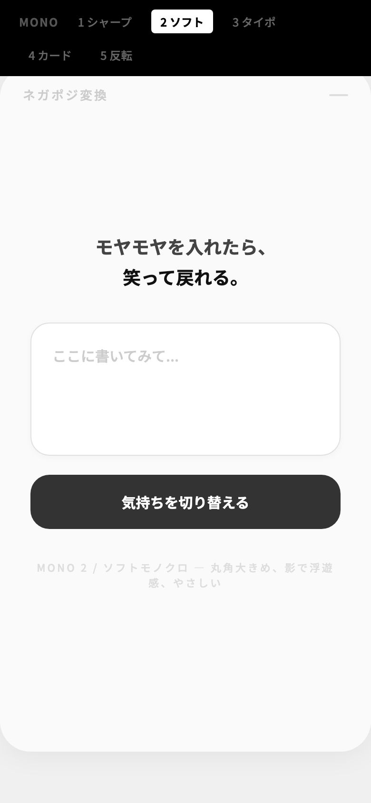 | 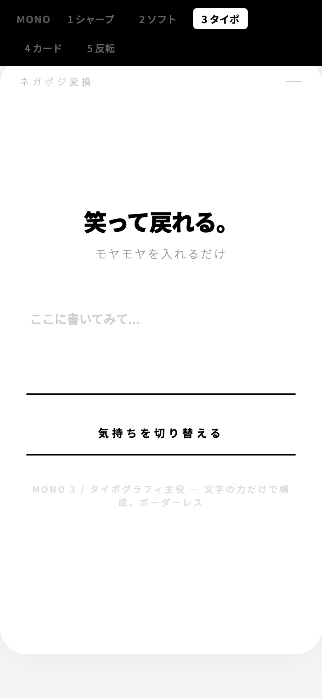 |

| 4. カード浮き | 5. 反転ダーク |
|:---:|:---:|
| 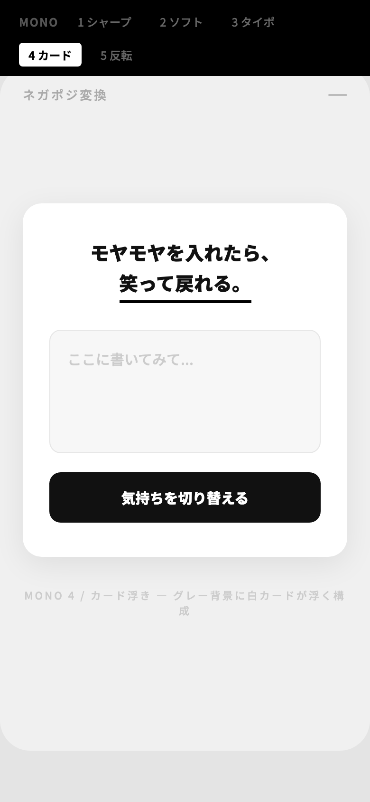 | 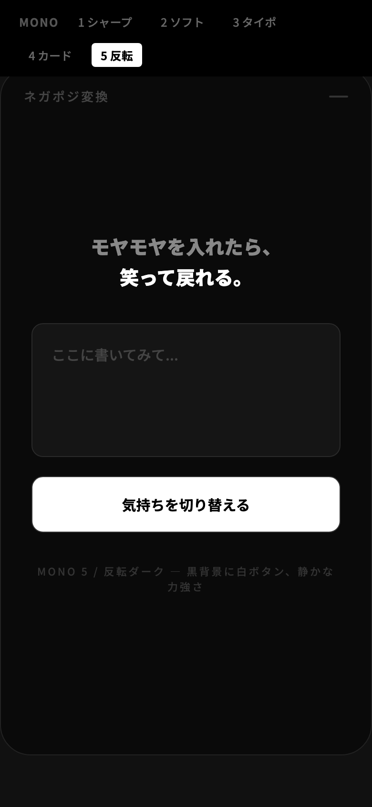 |

最終的に採用したのは **「Mono 1: シャープエッジ」** です。

**選んだ理由:**
- **角丸なし・太ボーダー** ── 「モヤモヤを吐き出す」行為に余計な装飾は要らないと感じた
- **白黒のモノクロ** ── ストイックで力強い印象がアプリの世界観に合っていた
- **入力欄とボタンが一体化** ── 迷わず「書いて、押す」だけの潔い構成

---

## 技術スタック

| 領域 | 技術 |
|---|---|
| フロントエンド | Next.js 16（App Router, TypeScript） |
| AI | Google Gemini 2.5 Flash |
| 認証・DB | Supabase（PostgreSQL + Auth） |
| UI | shadcn/ui + Tailwind CSS |
| デプロイ | Vercel |

### なぜこの構成にしたか

- **Next.js**: App RouterでServer ComponentsとAPI Routesを一つのプロジェクトに統合できる点が決め手でした
- **Gemini 2.5 Flash**: レスポンスが速く、トーン別のプロンプトに対して安定した出力が得られました
- **Supabase**: PostgreSQL + 認証 + RLS（行レベルセキュリティ）をワンストップで提供してくれるため、認証付きのデータ管理を素早く構築できました
- **Vercel**: Next.jsとの相性が良く、`git push` するだけでデプロイが完了します

---

## 実装で工夫したポイント

### プロンプト設計

7つのトーンそれぞれに専用のプロンプトを用意しています。出力フォーマットも「1行目: 格言（20文字以内）、3行目: 補足（1文）」と明確に指定することで、テンポよく読める結果を実現しました。

### Supabase Auth + RLS

Google OAuthとメール/パスワード認証の両方に対応しています。データベースにはRLS（Row Level Security）を設定しており、ユーザーは自分の変換履歴にだけアクセスできる仕組みです。

### UXへのこだわり

- **タイピングアニメーション**: 結果が一文字ずつ表示され、「AIが考えてくれている」感覚を演出
- **トーン別ローディングメッセージ**: 変換中にトーンに合わせたメッセージを表示（例: ドラクエ風なら「じゅもんを となえている…」）
- **レート制限**: 1時間あたり10回の変換制限を設けて、APIの過剰利用を防止

---

## 開発タイムライン

全体で約4時間の開発でした。

| フェーズ | 内容 | 所要時間 |
|---|---|---|
| デザイン探索 | 14パターンのワイヤーフレーム作成・比較 | 約1時間 |
| プロジェクト構築 | Next.js + 依存関係セットアップ | 約30分 |
| コア機能実装 | Gemini API連携・Supabase認証・全画面実装 | 約1時間 |
| 調整 | フォント修正・レイアウト改善 | 約1時間 |
| 認証強化 | Google OAuth追加 | 約30分 |

---

## まとめ

「仕事中のモヤモヤを笑いに変えたい」という小さなアイデアから、デザイン・実装・認証・デプロイまでを一気通貫で作り上げることができました。

Gemini APIのプロンプト設計やSupabaseのRLSなど、実際に手を動かしてみて学びの多いプロジェクトでした。もし興味があれば、ぜひ一度モヤモヤを入力してみてください。きっとクスッと笑えるはずです。
